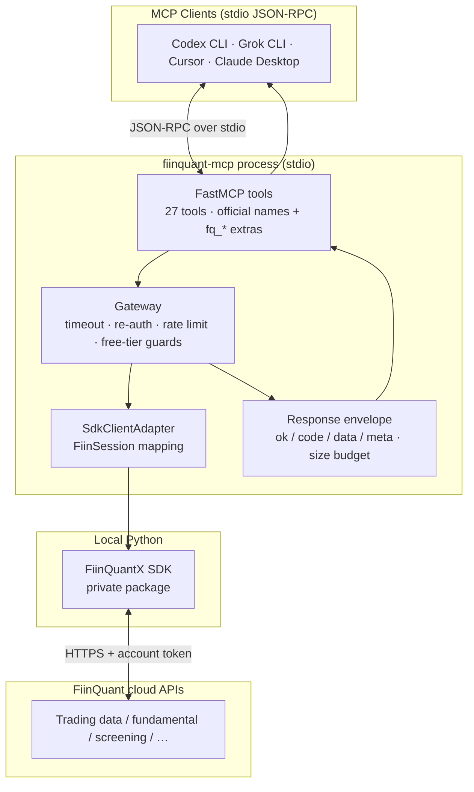
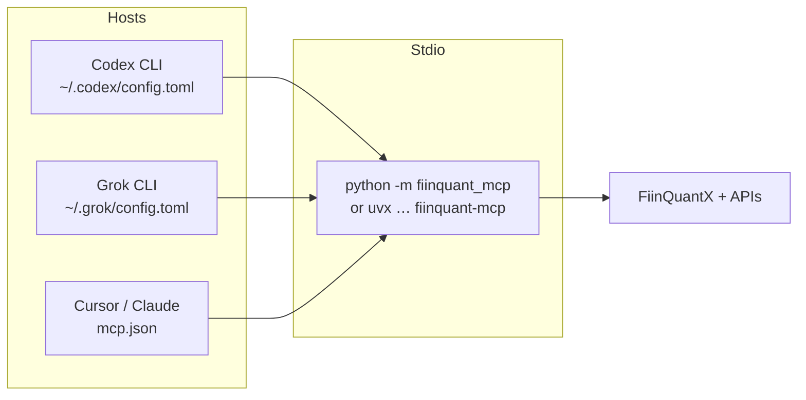
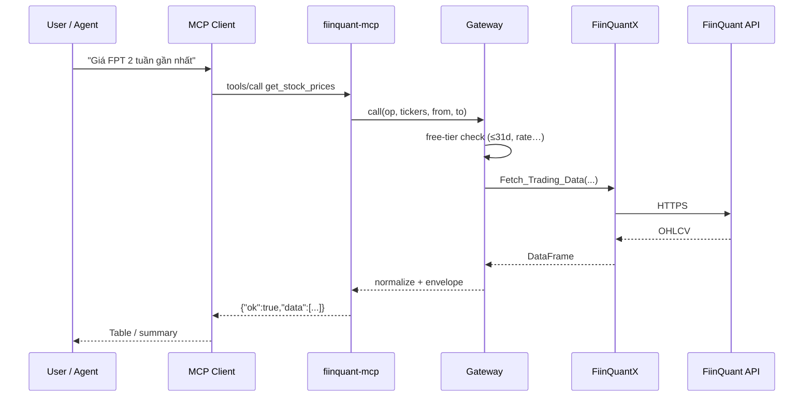

# fiinquant-mcp (personal)

Personal **resilient** MCP server wrapping the FiinQuant / **FiinQuantX** Python SDK for multiple clients over **stdio**:

| Client | Config | Example name |
|--------|--------|----------------|
| **Codex CLI** | `~/.codex/config.toml` | `fiinquant-sdk` |
| **Grok CLI** | `~/.grok/config.toml` | `fiinquant` |
| **Cursor / Claude Desktop** | `mcp.json` | `fiinquant-sdk` |
| **uvx** | any stdio host | inject SDK via `--with` |

> Not an official FiinGroup/FiinQuant product. Domain tool names match official FiinQuant MCP; personal extras keep the `fq_` prefix.

**Version:** 0.3.1 · **Tools:** 27 (21 official + 6 extras)

### AI-assisted install (Codex / Claude Code / Grok / Cursor)

User không cần đọc hết docs. Copy prompt trong:

**[`docs/AI_INSTALL_PROMPT.md`](docs/AI_INSTALL_PROMPT.md)**

→ dán vào agent → AI tự detect Python, `pip install -e`, đăng ký MCP (Codex/Grok/Claude/Cursor), smoke `fq_ping` / `get_stock_prices`.

Có bản **full** (chi tiết) và **short** (1 đoạn) trong file đó.

---

## How it works



**Data path:** client → MCP tool → Gateway (reliability + free limits) → FiinQuantX → FiinQuant API → JSON envelope back to agent.

**Auth:** `FIINQUANT_USERNAME` / `FIINQUANT_PASSWORD` in MCP env (not browser OIDC like official remote MCP).

---

## Quick start

### 1. Shared prerequisites

```bash
# Same Python that will run the MCP (example: system 3.11)
python3 -m pip install FiinQuantX          # or private wheel from portal
python3 -m pip install -e /path/to/fiinquant-python-mcp
python3 -c "import FiinQuantX, fiinquant_mcp; print('OK')"
```

SDK is private — not always on public PyPI. **One Python must have both** `FiinQuantX` and `fiinquant_mcp`.

Sample configs live under [`config/`](config/):

| File | Client |
|------|--------|
| [`mcp.codex.example.toml`](config/mcp.codex.example.toml) | Codex CLI |
| [`mcp.grok.example.toml`](config/mcp.grok.example.toml) | Grok CLI |
| [`mcp.cursor.example.json`](config/mcp.cursor.example.json) | Cursor / Claude Desktop |
| [`mcp.uvx.example.json`](config/mcp.uvx.example.json) | uvx isolated env |
| [`mcp.example.json`](config/mcp.example.json) | Generic JSON (uvx git) |

Naming tip: use **`fiinquant-sdk`** for this personal MCP. Keep **`fiinquant-local`** if you still run the official remote proxy (`npx fiinquant-mcp-proxy`).

### 2. Codex CLI

```bash
codex mcp add fiinquant-sdk \
  --env FIINQUANT_USERNAME='your@email.com' \
  --env FIINQUANT_PASSWORD='your_password' \
  --env FIINQUANT_PLAN=free \
  --env FIINQUANT_ENFORCE_PLAN_LIMITS=true \
  -- /Library/Frameworks/Python.framework/Versions/3.11/bin/python3 -m fiinquant_mcp

codex mcp list
# open a new Codex session and call tools (get_stock_prices, …)
```

Or paste TOML from `config/mcp.codex.example.toml` into `~/.codex/config.toml`.

```toml
[mcp_servers.fiinquant-sdk]
command = "/Library/Frameworks/Python.framework/Versions/3.11/bin/python3"
args = ["-m", "fiinquant_mcp"]

[mcp_servers.fiinquant-sdk.env]
FIINQUANT_USERNAME = "your@email.com"
FIINQUANT_PASSWORD = "your_password"
FIINQUANT_PLAN = "free"
FIINQUANT_ENFORCE_PLAN_LIMITS = "true"
```

### 3. Grok CLI

```bash
# After pip install -e . on the same Python as FiinQuantX
# Edit ~/.grok/config.toml — see config/mcp.grok.example.toml

grok mcp doctor fiinquant
```

```toml
# ~/.grok/config.toml
[mcp_servers.fiinquant]
command = "/Library/Frameworks/Python.framework/Versions/3.11/bin/python3"
args = ["-m", "fiinquant_mcp"]
enabled = true
startup_timeout_sec = 60

[mcp_servers.fiinquant.env]
FIINQUANT_USERNAME = "your@email.com"
FIINQUANT_PASSWORD = "your_password"
FIINQUANT_PLAN = "free"
FIINQUANT_ENFORCE_PLAN_LIMITS = "true"
```

### 4. Cursor / Claude Desktop

Copy [`config/mcp.cursor.example.json`](config/mcp.cursor.example.json) into Cursor MCP settings or Claude `claude_desktop_config.json` (paths differ by OS). Point `command` at the Python that has **both** packages.

### 5. uvx (isolated env)

Only if you inject the private SDK wheel:

```json
{
  "mcpServers": {
    "fiinquant-sdk": {
      "command": "uvx",
      "args": [
        "--from", "git+https://github.com/luongndcoder/fiinquant-python-mcp",
        "--with", "/path/to/FiinQuantX.whl",
        "fiinquant-mcp"
      ],
      "env": {
        "FIINQUANT_USERNAME": "your@email.com",
        "FIINQUANT_PASSWORD": "your_password",
        "FIINQUANT_PLAN": "free"
      }
    }
  }
}
```

### Client comparison



| | Codex | Grok | Cursor/Claude |
|--|-------|------|---------------|
| Config file | `~/.codex/config.toml` | `~/.grok/config.toml` | JSON MCP settings |
| CLI add | `codex mcp add … -- cmd` | `grok mcp add` / edit TOML | UI or JSON edit |
| Suggested server name | `fiinquant-sdk` | `fiinquant` | `fiinquant-sdk` |
| vs official proxy | Can coexist with `fiinquant-local` (npx proxy) | Independent | Independent |

---

## Plans: free vs paid / higher tiers

**MCP không khóa “free-only”.** Cả 27 tool luôn được expose. Free chỉ là **mặc định an toàn** (local guards + API account chặn một phần). Gói cao hơn → cùng MCP, **mở thêm data** khi FiinQuant cấp permission.

Hai lớp độc lập:

| Lớp | Ai kiểm soát | Free | Paid / gói cao |
|-----|----------------|------|----------------|
| **Local guards** (MCP Gateway) | Env `FIINQUANT_PLAN`, `FIINQUANT_*` limits | Siết history/rate/ticker | Nới hoặc tắt |
| **API permission** (FiinQuant cloud) | Gói account trên FiinQuant | Nhiều endpoint 403 | Tool trước đó 403 → trả data |

```text
Upgrade account FiinQuant  +  FIINQUANT_PLAN=paid  →  full surface dùng được (theo đúng quyền gói)
```

### Local guards

#### `FIINQUANT_PLAN=free` (default)

| Limit | Value |
|-------|--------|
| Connections | 1 session |
| Requests / min · / s | 90 · 80 |
| Realtime tickers / call | ≤ 33 |
| History window | ≤ **31 days** |
| Intraday TF | `1m`, `5m`, `15m`, `1h`, `4h` (+ Daily) |

Over limit → JSON `VALIDATION` or `RATE_LIMIT` (process does **not** crash).

#### `FIINQUANT_PLAN=paid` (hoặc gói cao hơn)

```toml
# Codex / Grok env block
FIINQUANT_PLAN = "paid"
# optional: nới tay nếu gói cho phép
# FIINQUANT_MAX_HISTORY_DAYS = "365"
# FIINQUANT_MAX_REALTIME_TICKERS = "200"
# FIINQUANT_REQUESTS_PER_MINUTE = "600"
# FIINQUANT_REQUESTS_PER_SECOND = "200"

# hoặc giữ plan=free nhưng tắt local guard (cẩn thận quota):
# FIINQUANT_ENFORCE_PLAN_LIMITS = "false"
```

`paid` nới default local caps (history dài hơn, rate/ticker cao hơn). **Quyền API thật** vẫn do gói FiinQuant quyết định — MCP không fake data.

### Live suite (account free) — tool status

Tested end-to-end with FiinQuantX + free account (see `plans/.../tool-test-report.json`).

| Status | Meaning | Count |
|--------|---------|-------|
| **Works** | Returns real data | 21 |
| **Blocked by free API** | Tool runs; FiinQuant returns 403 / no permission | 6 |
| **Crash** | — | 0 |

**Works on free (typical):**

- `get_stock_prices`, `fq_get_price_history`
- `get_financial_ratios`, `get_financial_statements`
- `get_valuation_timeseries`, `get_equity_snapshot`
- `get_rrg_analysis`, `get_rebalance`
- `get_technical_indicators`, `detect_pattern`
- `get_market_statistics`, health/meta tools

**Often 403 on free — expect data on higher plans:**

| Tool | Typical free error | After upgrade |
|------|--------------------|---------------|
| `get_basic_info` / `fq_ticker_info` | ApiAccessFailed 403 | Company / ICB metadata |
| `screen_stocks` | Screening API 403 | Filter ROE/PE/… |
| `get_market_breadth` | No permission MarketBreadth | Advance/decline |
| `get_money_flow_contribution` | No permission MoneyFlow | Top gainers/losers flow |
| `get_index_constituents` | 403 | VN30 members, … |

Envelope when blocked (tool path still healthy):

```json
{"ok": false, "code": "SDK_ERROR", "message": "…permission…", "hint": "…"}
```

**Checklist sau khi nâng gói FiinQuant:**

1. Set `FIINQUANT_PLAN=paid` (và/hoặc nới `FIINQUANT_MAX_*`) trong env MCP.
2. Restart client session (Codex / Grok / Cursor).
3. Gọi lại tool từng 403 (vd `screen_stocks`, `get_basic_info`).
4. Nếu vẫn 403 → gói account chưa mở đúng API (không phải MCP thiếu tool).

---

## Response format

Success:

```json
{"ok": true, "data": …, "meta": {"truncated": false, "row_count": 10}}
```

Error (tool failure ≠ process die):

```json
{"ok": false, "code": "TIMEOUT|AUTH|SDK_ERROR|VALIDATION|RATE_LIMIT|INTERNAL", "message": "…", "hint": "…"}
```

`tickers` accepts `["FPT","VNM"]` or `"FPT,VNM"`.

---

## Prompt guide (per tool)

Copy/adapt prompts for your agent. Prefer **official tool names** first.

### Health & meta

| Tool | When to use | Example prompt |
|------|-------------|----------------|
| `fq_ping` | Check MCP alive | “Ping FiinQuant MCP xem process còn sống không.” |
| `fq_session_status` | Creds / plan / rate | “Kiểm tra session FiinQuant: đã login chưa, plan free limits thế nào.” |
| `fq_list_ops` | List gateway ops | “Liệt kê các op Gateway hỗ trợ.” |
| `report_issue` | Local debug note | “Ghi issue local: tool X lỗi Y khi hỏi Z.” *(chỉ log local, không gửi admin FiinQuant)* |
| `fiinquantx_search_methods` | Discover SDK methods | “Search method FiinQuantX chứa Fetch.” |
| `fiinquantx_call_method` | Escape hatch | “Dry-run call method_id=login với params {}.” |

### Market / prices

| Tool | When to use | Example prompt |
|------|-------------|----------------|
| **`get_stock_prices`** | Giá / OHLCV chính | “Lấy giá **FPT** 2 tuần gần nhất (Daily, adjusted).” · “OHLCV FPT và VNM từ 2026-07-01 đến 2026-07-15.” · “Giá **VNINDEX** tuần qua.” |
| `fq_get_price_history` | OHLCV đơn giản start/end | “Price history VNM start=2026-07-01 end=2026-07-15.” |
| `get_market_statistics` | Stats (cap, foreign…) | “Market statistics FPT từ 2026-07-01 đến 2026-07-15, time_filter=Daily.” |
| `get_market_breadth` | Breadth index | “Market breadth VNINDEX.” *(free: often no permission)* |
| `get_index_constituents` | Thành phần chỉ số | “Lấy danh sách mã **VN30**.” *(free: often 403)* |
| `get_money_flow_contribution` | Dòng tiền / đóng góp | “Top gainers đóng góp VNINDEX 1Day, limit 10.” *(free: often no permission)* |
| `get_realtime_bid_ask` | Bid/ask | “Bid/ask realtime FPT.” *(SDK streaming; may return guidance note)* |

**Tips `get_stock_prices`:**

- Always pass **`from_date` + `to_date`** (YYYY-MM-DD); free max span **31 days**.
- `frequency`: `Daily` or `1m`/`5m`/`15m`/`1h`/`4h`.
- Multiple tickers: `["FPT","VNM"]`.

### Universe

| Tool | When to use | Example prompt |
|------|-------------|----------------|
| `get_basic_info` | Tên, sàn, ngành | “Basic info FPT, VNM.” *(free: often 403)* |
| `get_icb_industries` | ICB levels | “List ICB industries level=2.” |
| `fq_list_tickers` | List theo sàn | “List tickers market=HOSE.” |
| `fq_ticker_info` | 1 mã metadata | “Ticker info FPT.” *(free: often 403)* |

### Fundamental

| Tool | When to use | Example prompt |
|------|-------------|----------------|
| **`get_financial_ratios`** | Chỉ số tài chính | “Financial ratios FPT years 2024 và 2025.” |
| **`get_financial_statements`** | BCTC | “Income statement FPT năm 2024 (consolidated).” · “Balance sheet FPT statement=balance_sheet years=[2024].” |
| `get_valuation_timeseries` | Lịch sử định giá | “Valuation timeseries FPT scope=stock from 2026-06-15 to 2026-07-15.” |
| `get_equity_snapshot` | Snapshot gần đây | “Equity snapshot FPT metrics pe,pb.” |

**`statement` values:** `income_statement` · `balance_sheet` · `cashflow` · `full` · `note`

### Screening & technical

| Tool | When to use | Example prompt |
|------|-------------|----------------|
| `screen_stocks` | Lọc cổ phiếu | “Screen HOSE: ROE > 15, limit 20.” *(free: often 403)* |
| `get_technical_indicators` | RSI/MACD/… | “RSI 14 và MACD cho FPT, by=1d.” |
| `detect_pattern` | Mẫu nến / pattern | “Detect doji trên FPT từ 2026-06-15 đến 2026-07-15.” |
| `get_rrg_analysis` | RRG vs benchmark | “RRG FPT,VNM vs VNINDEX 1 tháng gần nhất.” |
| `get_rebalance` | Phân bổ theo rổ | “Rebalance VN30 với budget 1 tỷ VND.” |
| `run_custom_analysis` | Custom / list | “List custom analyses available.” |

**Screen filters example (JSON):**

```json
[{"indicator": "roe", "operator": "gt", "value": 15}]
```

**Pattern `params` example:**

```json
{"tickers": ["FPT"], "from_date": "2026-06-15", "to_date": "2026-07-15", "by": "1d"}
```

---

## Example agent workflows

### A. Xem giá nhanh

```text
Dùng get_stock_prices lấy OHLCV FPT 2 tuần gần nhất (Daily, adjusted).
Tóm tắt close đầu/cuối kỳ, % thay đổi, volume bất thường.
```

### B. Phân tích fundamental

```text
1) get_financial_ratios FPT years 2024,2025
2) get_financial_statements FPT income_statement 2024
So sánh revenue / net profit / EPS.
```

### C. So sánh 2 mã + index

```text
get_stock_prices tickers=[FPT,VNM,VNINDEX] from_date=… to_date=… (≤31 ngày free).
Bảng close theo ngày + nhận xét tương quan ngắn hạn.
```

### D. Khi tool 403

```text
Nếu SDK_ERROR permission/403: báo user đây là hạn mức gói free FiinQuant,
không phải MCP die; gợi ý tool thay thế (vd giá thay vì screen).
```

---

## Environment

| Variable | Default | Meaning |
|----------|---------|---------|
| `FIINQUANT_USERNAME` | — | SDK username |
| `FIINQUANT_PASSWORD` | — | SDK password |
| `FIINQUANT_PLAN` | `free` | `free` \| `paid` |
| `FIINQUANT_ENFORCE_PLAN_LIMITS` | `true` | Local rate/history/ticker guards |
| `FIINQUANT_MAX_HISTORY_DAYS` | `31` (free) | Max date span |
| `FIINQUANT_MAX_REALTIME_TICKERS` | `33` | Cap per realtime-ish call |
| `FIINQUANT_REQUESTS_PER_MINUTE` | `90` | Local RPM |
| `FIINQUANT_REQUESTS_PER_SECOND` | `80` | Local RPS |
| `FIINQUANT_TIMEOUT_S` | `30` | Per-call timeout |
| `FIINQUANT_MAX_ROWS` | `500` | Response row budget |
| `FIINQUANT_MAX_CHARS` | `80000` | Response char budget |

---

## Architecture vs official MCP

| | Official FiinQuant MCP | This MCP |
|--|------------------------|----------|
| Tool names | `get_stock_prices`, … | **Same** + `fq_*` extras |
| Auth | Browser / OIDC remote | Local SDK user/pass |
| Transport | Streamable HTTP | **stdio** |
| Reliability | Vendor | Timeout, envelope, size budget, free guards |
| `report_issue` | Admin upload | Local log only |



---

## Develop

```bash
git clone https://github.com/luongndcoder/fiinquant-python-mcp.git
cd fiinquant-python-mcp
# Use a Python that already has FiinQuantX
pip install -e ".[dev]"
pytest -v
python -m fiinquant_mcp   # stdio server
```

Unit tests mock the SDK boundary (no network). Live suite: `plans/20260715-fiinquant-personal-mcp/tool-test-report.json`.

---

## License

MIT for this wrapper only. FiinQuant SDK and market data remain under FiinQuant terms of use. Do not commit credentials.
